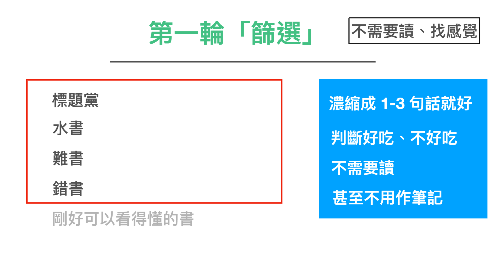
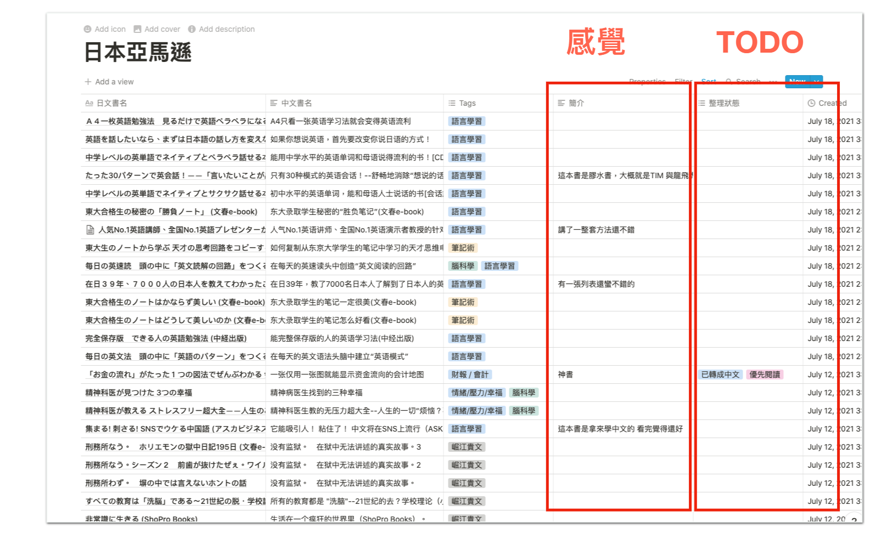
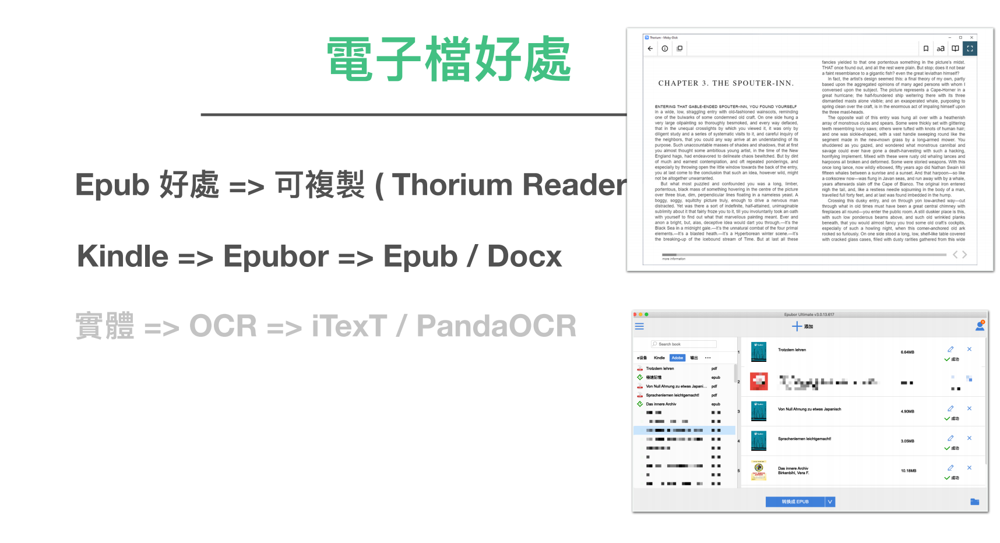
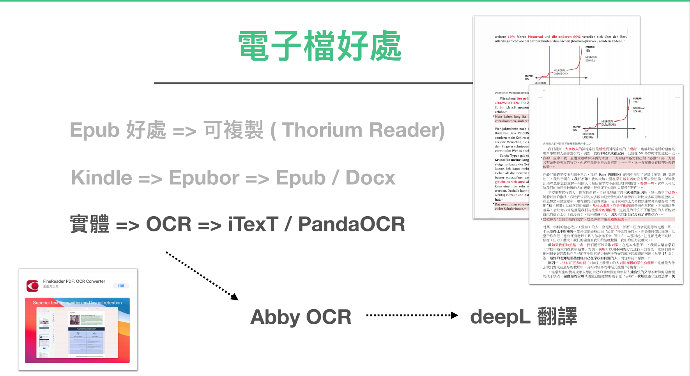
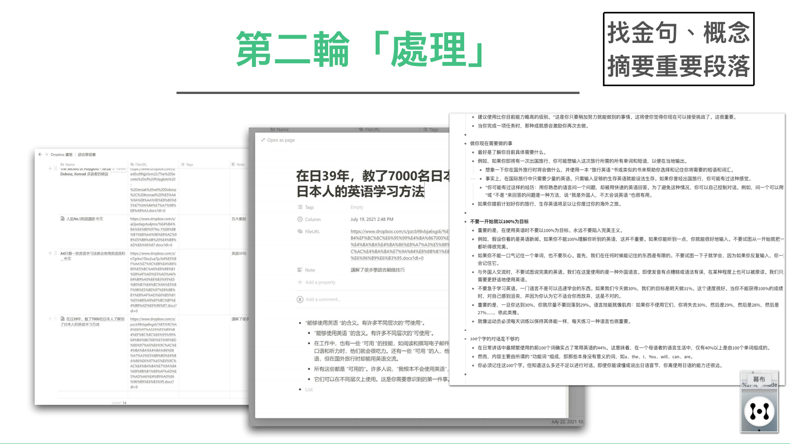

# 讀書篇 (2) 輕鬆的將書中的資訊有效納為己用

有些讀者可能會覺得我老是說「扔書」，內心會十分捨不得。

但事實上讀書就像煮菜一樣，買回來本來就是要洗，要切才能吃。而且，如果每一本書都是作者的排泄物的話。買回來本來就要先處理。你想想，豬大腸買回來要是不洗直接下鍋煮的話，不就會吃的滿嘴屎味嗎？

這其實也是許多讀者為什麼根本性的討厭讀書一樣。因為沒有經過三輪買書法，直接買回來的書，多半等於直接生啃，一嘴咬下去啃不動，或者是吃到一嘴的泥土與爛菜！

### 每一本書都要讀完嗎？

但是，各位讀者可能也會有下一個問題，我們要篩書，豈不是也要看書嗎？那還不是回到原點嗎

！？

非也。其實第一輪書，根本是不用細看的。更進一步的說，這些書你根本不用「看」！

只需要找感覺就好。其實很多讀書大家（號稱自己讀過很多書的人），多半買書也只是當時隨手翻翻而已。卻唬大家說他看了。

事實上，真要精讀一本書是非常耗時間的，若他將自己買的書每一本都大致「略讀」一遍，甚至都要花上一百年的時間。所以，真正的真相可能是他只有隨時翻一翻就宣稱自己有看了。

但說「看」這件事。我們要定義到多嚴呢？其實法律上也沒有規定。

而第一輪買書，本來就是拿來過濾學習方向而已，所以，你大可隨便看看！只要找感覺就好。好看、疑似正確的就留下。其他放著也沒關係。

我在第一輪，甚至是都只大概看目錄，看個10-20頁而已。確定這本書是正確的書後，就對其歸檔。

這是我在 NOTION上做的買書列表，書買進來變成電子檔後，第一輪我只做兩件事，
1.　用一兩句話表達「翻過」這本書的「感覺」，
2.　在我「稍後有空」時，再決定要對這本書做「精讀」還是「略讀」，還是可以乾脆不要讀。

### 盡量都買電子書，或將書轉為電子檔

我在江湖上有個奇怪的癖好，是喜歡把我買的實體書，裁切掉並且轉檔成為電子書。

這樣做的好處很多

1. 最直觀的就是可以壓低書籍所佔的空間。（我真正下定決心開始將書電子化時，是在2015年，我察覺到我房子越換越大，但是房子大部分的空間，卻填滿著書時，心想再這樣下去不行。我等於是繳錢讓房子住，而不是給自己住）
2. 轉成電子檔後可以在平版上閱讀。（有時候，我買了一些新書想在出差上的飛機看，但是如果行李裡面塞著新書，真的是很智障的行為。難拿又重的要死。如果是裁成電子檔，平版裡面可以塞幾百本書沒有問題）
3. 轉成電子檔後，方便我做筆記。其實這才是最關鍵的原因。

我在2016年發表了「極速讀書法」後，一時大受好評。因為這個讀書法，可以讓一般人讀一本書的時間，從幾小時降到30分鐘。

「極速讀書法」的原理是看書快速掃毒，摘錄關鍵字，再整理成心得。

但這個方法並不是沒有缺點。這個方法最大的缺點是，必須要用手謄抄。而且當一本書例子太多時，光抄例子就費勁。當重點太多時，也是寫筆記起來非常費勁。

於是，在2018年時，我就不用這個方法了。我改用「複製貼上法」。

什麼叫複製貼上法呢？

其實就是我把書上的字，只要觸動我的句子、或例子，直接複製貼到我的「第一層」讀書「金句」筆記。等貼完一本書之後，我再重排整理這些金句，然後寫出自己理解的心得。

效果是一樣的。但是完全沒有「摘超太多」的「身體勞累」。

舉例來說，我就會將第一輪找到的書，將金句複製到「幕布」這個軟件，稍微排版以後，寫成我的「金句筆記」。

因為對我來說，金句才是重要的。其他的不重要。

你可以想像成書中的「營養素」才是本體，而書本是「纖維質」，菜買回來要先洗乾淨，再切成塊、打成泥。生啃很容易反而營養還沒吸收到，先吃了一堆菜上的土消化不良被撐死。

### 用現代切菜機，幫助你的讀書效率

如何將書的「內容」電子化呢？有幾個方法

a) 直接買電子檔，如 KINDLE 或一些電子書廠商的書。你可以購買後，再用轉檔軟體如（EPUBOR) 轉成能夠複製內文格式的書格式（EPUB)

b) 使用截圖識字軟件。有時候，書實在無法「被轉檔」。現在辨識軟件已經很成熟，有一些軟件可以讓你截圖段落然後轉成文字。反正你也只是要金句嘛！就只 OCR 該句也足夠了。

c) 如果該本書真的重點很多，一塊一塊辨識真的很麻煩，再用 OCR 軟件辨識整本書也不遲（OCR軟件辨識很吃電腦效能）

就是為什麼我喜歡將實體書都掃描成電子檔的原因，因為掃成電子檔，可以方便我摘拆。

如果直接閱讀實體書的話。心理上與實際上也很難做到「將書上的字剪下來貼到筆記本上」，更不用說真的這樣做的話，無敵費功夫！

基本上在第一輪買書時，我是能買電子檔就買電子檔。第二輪就會買電子+實體雙版本。因為實體可以方便我大概的翻閱。

如果進到第三輪的書，甚至我自己會實體的多買幾本（收藏、畫線、剪貼、贈送他人等等）

（i.e. 各位讀者有興趣使用這個方法的話，可以購買 iPad 上的 Marginnote3 這個軟體）

### 用 Notion 進行金句筆記

轉檔、掃描過後的書，我會放到DROPBOX，再透過ZAPPIER自動流程軟體，每新增一本書，就會在我的閱讀列表裡面新增一筆記錄。

剛買進來，我會上去為每本書打感覺、TAG、TODO。

第二輪時，只要把上面的書名點出來，我就可以在裡面貼金句了！

### 第三輪吸收：打果菜汁、炒家常菜

而到了第三輪。我會進行吸收動作。

這有兩種方法。

一是「打果菜汁」

打果菜汁就是

1. 摘錄金句
2. 整理金句
3. 整理寫下自己綜合想法

二是「炒一盤家常菜」

炒家常菜是

1. 找出正確流程
2. 組出自己可以做的流程
3. 拼起來玩看看，至少練1-2回

打果菜汁與實際炒一輪家常菜的差異在於，前者是知道知識。後者是學會技能。

大部分人為什麼通常在只到達「喝果菜汁」的階段，是因為在一般人的讀書流程中，就已經會被搞的筋疲力盡了。何況再嘗試真的下去炒菜、擺盤、切盤呢？

果菜汁固然很快吸收，但在體內停留時間較短。並沒有透過身體的演練，達到更強的固化效果。

不過。如果能做到吃菜洗乾淨，切掉自己不要的部分，細切成小條，打成果菜汁，然後喝下過濾的成本，這也比99.99%的人強的太多了。

很多朋友總覺得為何我對於學習樂此不疲，能夠堅持。

實際上只是因為我其實永遠先洗乾淨切好再吃，避免吃土而已。
